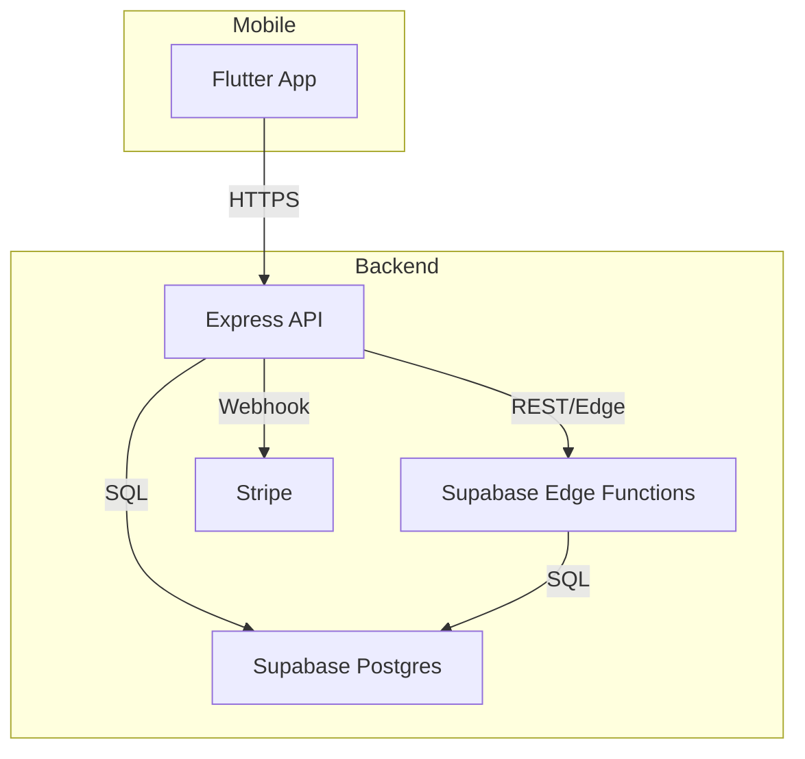

# WorldChef Architecture

```mermaid
graph TD
    subgraph Backend
        A[Express API]
        B[Supabase Postgres]
        C[Supabase Edge Functions]
        D[Stripe]
    end

    subgraph Mobile
        M[Flutter App]
    end

    M -->|HTTPS| A
    A -->|REST/Edge| C
    A -->|SQL| B
    C -->|SQL| B
    A -->|Webhook| D
``` 