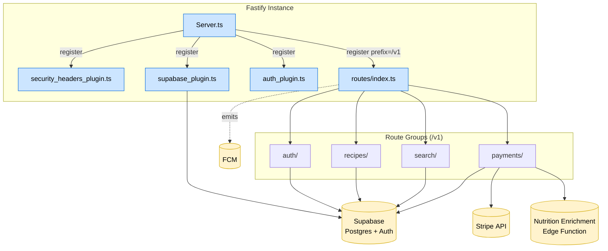

# WorldChef – Backend API Architecture (Fastify Plugin View)

> Cycle 4 Architectural Formalization – task af_t002_impl  
> Source: `backend/src/` structure, validated ADR-WCF-003, ADR-WCF-015.

### Notes
- **Plugins**: Modular concerns (security headers, Supabase client, JWT/auth).  
- **Routes**: Grouped under `/v1/` per ADR-WCF-015 versioning policy.  
- **External Calls**: Payment & notifications handled via Stripe and FCM; recipe nutrition via Edge Function.  
- Diagram intentionally abstracted (C4 Component level) for clarity; deeper sequence diagrams tracked elsewhere. 