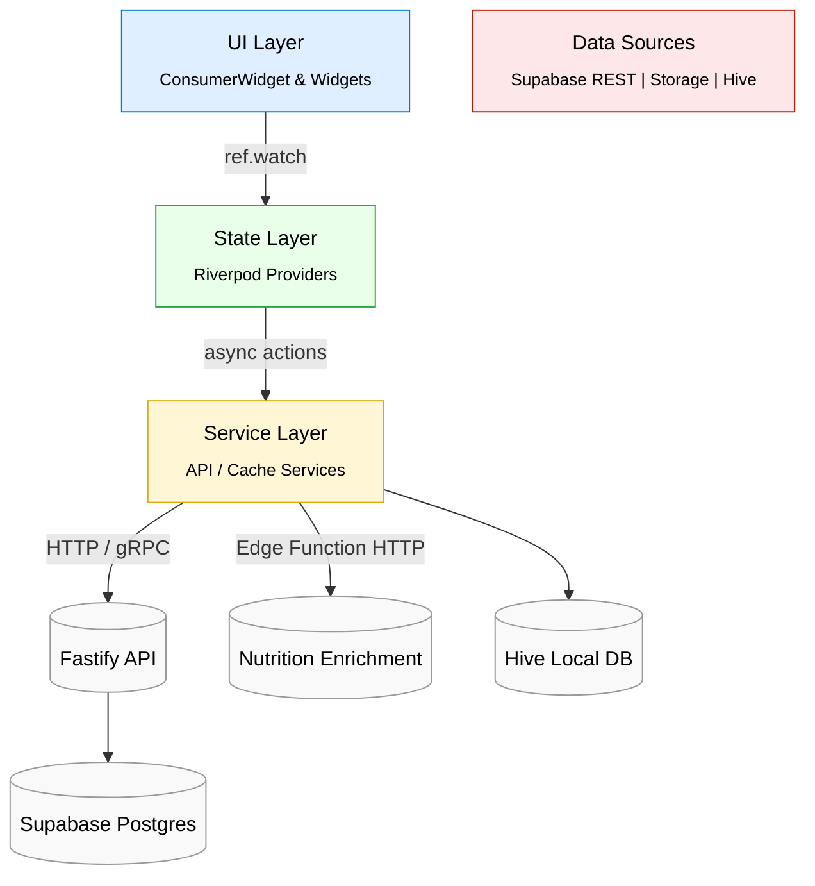

# WorldChef – Mobile Client Architecture (Flutter Layered View)

> Cycle 4 Architectural Formalization – task af_t003_impl  
> Reflects validated patterns from ADR-WCF-004, ADR-WCF-025.

### Layer Responsibilities
1. **UI Layer** – Flutter widgets driven by Riverpod; minimal logic.
2. **State Layer** – Riverpod Async/Notifier providers, optimistic updates.
3. **Service Layer** – Dio HTTP clients, retry logic, cache adapters.
4. **Data Sources** – Supabase REST endpoints, Hive offline store, Edge Functions. 