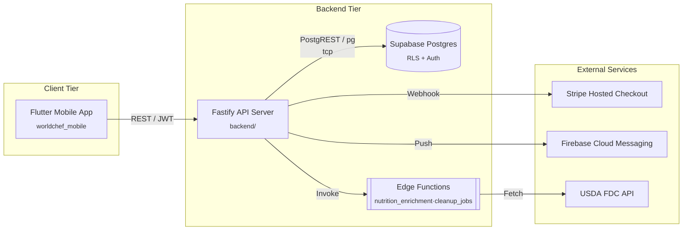

# WorldChef – System Architecture Overview (C4 Level 2)

> Part of Cycle 4 Architectural Formalization (task af_t001_impl).  
> Source of truth: validated ADR library & `aiconfig.json`.

This diagram illustrates the primary runtime containers for the MVP:

1. **Flutter Mobile App** – worldchef_* package in the repository
2. **Fastify API Server** – `backend/` project, deployed on Render
3. **Supabase Postgres** – managed relational store with RLS, Auth, Storage
4. **Supabase Edge Functions** – serverless functions for nutrition enrichment & background jobs
5. **External Services** – Stripe, FCM, and USDA API integrations

Links to detailed component views will reside in subsequent diagrams (`backend-api.md`, `mobile-client.md`). 

### Diagram Notes
- **Clickable nodes** (hover & click) take you directly to source code or external docs.
- Aligns with ADR-WCF-003 (Backend), ADR-WCF-001d (Database/BaaS), ADR-WCF-007 (Payments), ADR-WCF-009 (Push).
- This refined diagram improves readability and traceability for technical due-diligence reviewers. 